# VibeHub 🥰

A modern social media app built with React and Supabase.

🔗 **Live Demo:** [vibehub-v1.netlify.app](https://vibehub-v1.netlify.app)

---

## 📸 Screenshots

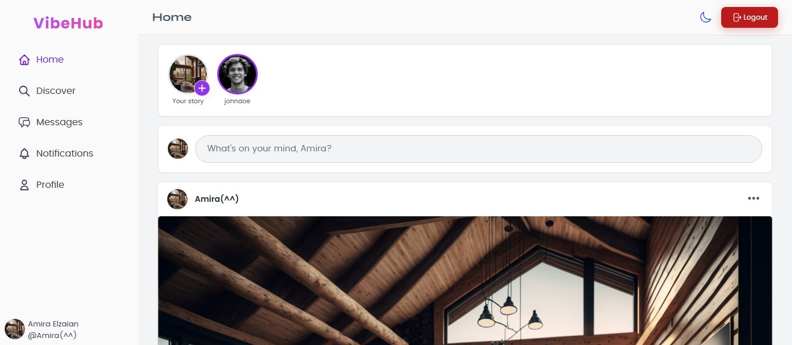
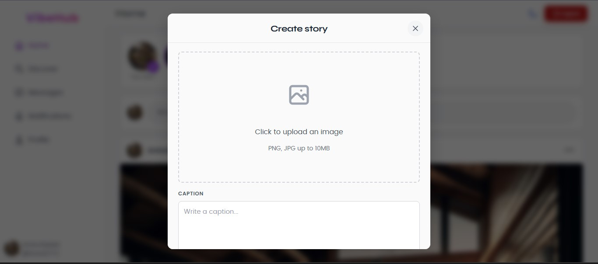
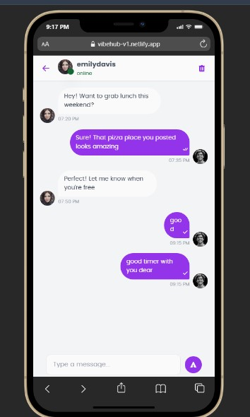
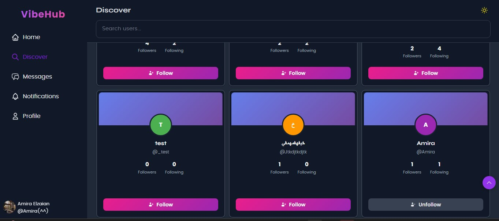
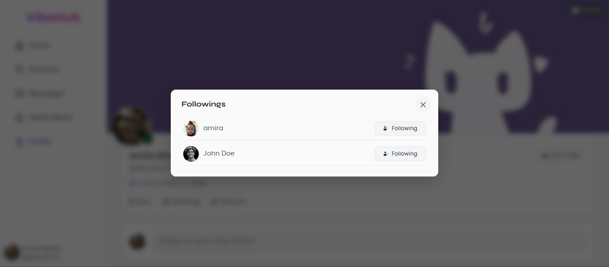
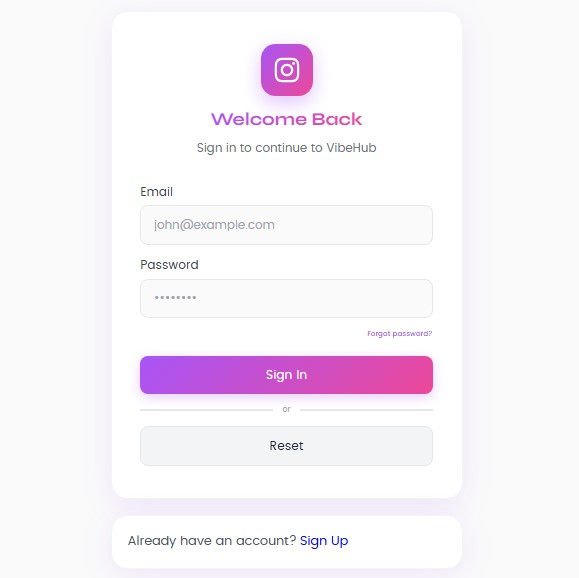
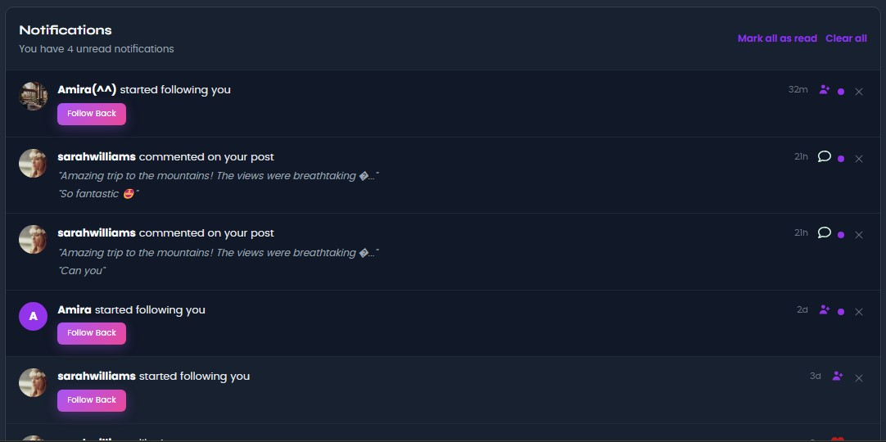
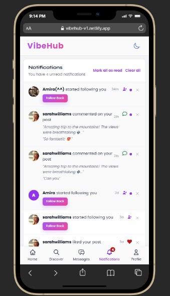
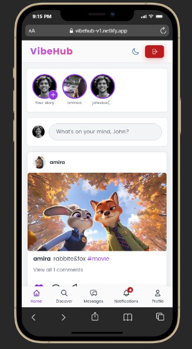
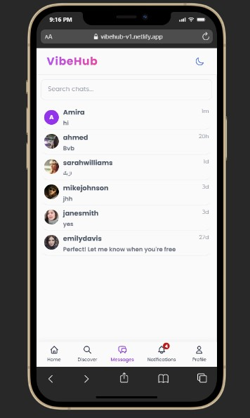
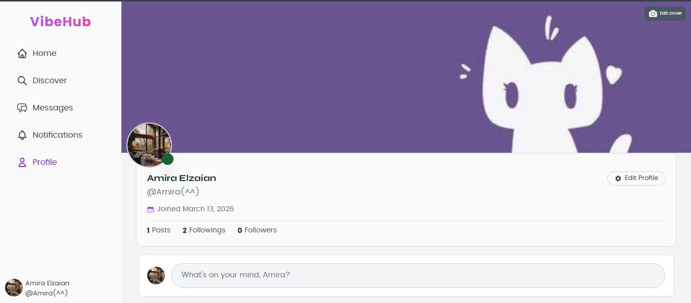


---

## ✨ Features

- 🔐 Authentication (signup, login, email confirmation)
- 📸 Stories (24h expiry, image + caption)
- 💬 Real-time messaging 
- ❤️ Posts, likes, comments
- 🔔 Notifications
- 👥 Follow / unfollow
- 🟢 Online presence indicator
- 🌙 Dark mode
- 📱 Fully responsive (mobile + desktop)

---

## 🛠️ Tech Stack

| Frontend | Backend |
|----------|---------|
| React 19 | Supabase |
| React Router | PostgreSQL |
| React Query | Supabase Storage |
| Styled Components | Row Level Security |
| Vite | Realtime subscriptions |

---

## 🚀 Getting Started

### 1. Clone the repo
```bash
git clone https://github.com/yourusername/vibehub.git
cd vibehub
```

### 2. Install dependencies
```bash
npm install
```

### 3. Add environment variables
Create a `.env` file:
```
VITE_SUPABASE_URL=your_supabase_url
VITE_SUPABASE_ANON_KEY=your_supabase_anon_key
```

### 4. Run the app
```bash
npm run dev
```

---

## 👩‍💻 Author

Made with ❤️ by [Amira Alzaian](https://github.com/amiraelzaian)
